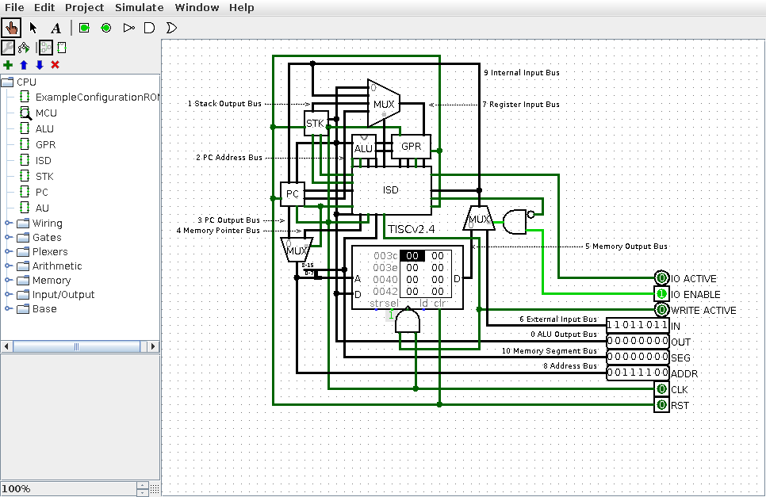
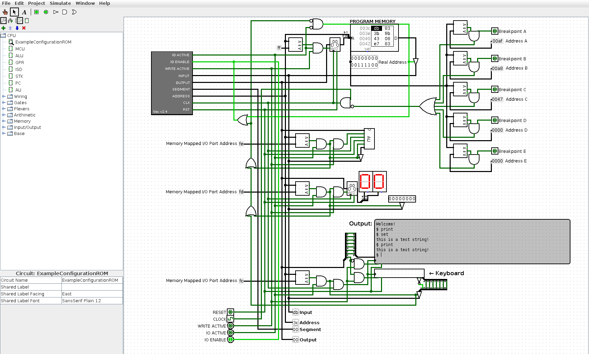

# Tiny Instruction Set Computer

This is a for-fun implementation of a relatively simple micro-architecture, with
an assembler to program the simulated implementation in [Logisim](http://www.cburch.com/logisim/).

My goal with this project is to aim for an instruction set architecture that is
focused on minimal scale. I've [written about the first ressurection of this
project on my blog](https://banna.tech/post/dusty_digital_and_forgotten_ideas/)
before and I am sporatically finding ways to explore the original idea of
"minimal scale" through modifications and continuation of work contained within
this repository.

## Want to play with it too?

The default program loaded in the ExampleConfigurationROM circuit is the
`ExamplePrograms/expanded_terminal.tac` program. The program is an interactive demo
which processes text input from the keyboard component and echoes the text out
to the TTY component. The 32 characters are buffered and compared to existing
command strings with routines to execute per each command string.

## Compiling the assembler

To compile the assembler, I recommend using GCC:

	$ gcc tisc.c -o tisc

## Using the assembler

Once the assembler is compiled, you can assemble TISC assembly code like so:

	$ tisc <input file> <output file>

If the assembler found no errors in the code, the output file will contain the
program that is ready to load into the Logisim circuit.

A successful output will appear like this:

	$ ./tisc ExamplePrograms/fibb_test.tac out
	Assembling tac file: 'ExamplePrograms/fibb_test.tac' TISC v2.4
	label line  addr:out>op         args
	      0003  0000:43| li 0xFD
	            0001:fd|
	      0004  0002:9f| sp GRA
	      0006  0003:c2| one        GRC
	loop  0008  0004:ab| sb GRB
	      0010  0005:c9| xor        GRB GRC
	      0011  0006:cd| xor        GRC GRC
	      0012  0007:c9| xor        GRB GRC
	      0014  0008:ba| op GRB GRC GRB
	      0016  0009:fb| cmp        GRB GRC
	      0017  000a:83| jmp        loop
	            000b:04|
	      0019  000c:ab| sb GRB
	end   0020  000d:83| jmp        end
	end         000e:0d|
	Finished assembling tac file: 'ExamplePrograms/fibb_test.tac', program size: 15 bytes

## Loading a program

The provided example application in the circuit ExampleConfigurationROM is a 
configuration with memory-mapped I/O. The I/O at memory address 0xFF is a ROM 
that acts as the program memory. Left-clicking on the component and selecting
'Load Image' will allow you to load memory images generated by the assembler. 
