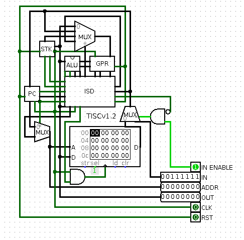

# Tiny Instruction Set Computer

This is a for-fun implementation of a relatively simple microarchitecture, with
an assembler to program the simulated implementation in [Logisim](http://www.cburch.com/logisim/).

## Want to play with it too?

To compile the assembler, I reccomend using GCC:

	gcc tisc.c

To start Logisim with the provided .jar file:

	java -jar CPU/logisim.jar CPU/CPU.circ

Otherwise, if you already have logisim installed on your computer I reccomend using that version instead. I have the .jar file packaged to make the project more portable

I recommend getting familiar with Logisim if you'd like to play with this circuit until there are more sophisticated peripherals available in the Logisim implementation
