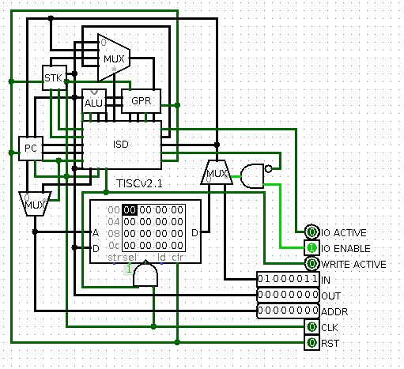
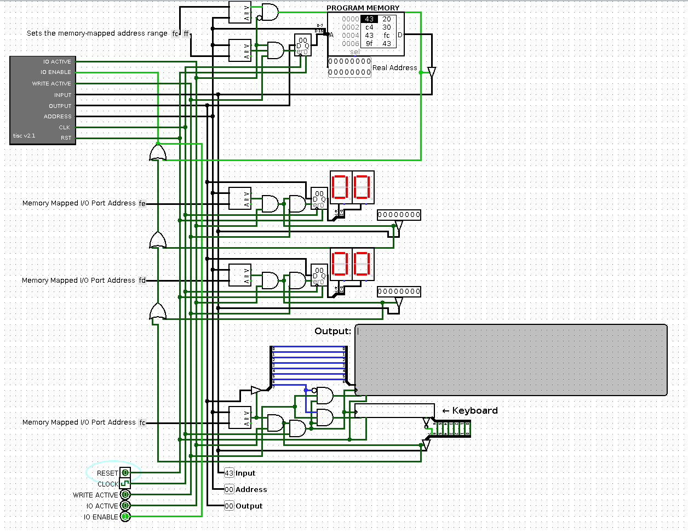

# Tiny Instruction Set Computer

This is a for-fun implementation of a relatively simple micro-architecture, with
an assembler to program the simulated implementation in [Logisim](http://www.cburch.com/logisim/).

## Want to play with it too?

The default program loaded in the ExampleConfigurationROM circuit is the
`ExamplePrograms/terminal_test.tac` program. The program is an interactive demo
which processes text input from the keyboard component and echoes the text out
to the TTY component. In addition, the program buffers 32 characters and tests
the buffer once the user inputs a line feed (enter key) against a target string.

## Compiling the assembler

To compile the assembler, I recommend using GCC:

	$ gcc tisc.c -o tisc

## Using the assembler

Once the assembler is compiled, you can assemble TISC assembly code like so:

	$ tisc <input file> <output file>

If the assembler found no errors in the code, the output file will contain the
program that is ready to load into the Logisim circuit.

A successful output will appear like this:

    $ tisc ExamplePrograms/fibb_test.tac out
	Assembling tac file: 'ExamplePrograms/fibb_test.tac' TISC v2.1
	ln# [addr]:label <op> <args>
	002 [0x00]:start lli    0
	003 [0x01]:      mov    GRA     GRB
	005 [0x02]:      li     254
	006 [0x04]:      sp     GRA
	008 [0x05]:      lli    1
	009 [0x06]:      mov    GRA     GRC
	011 [0x07]:loop  sb     GRB
	013 [0x08]:      sop_xor
	014 [0x09]:      op     GRB     GRC     GRC
	015 [0x0a]:      op     GRB     GRC     GRB
	016 [0x0b]:      op     GRB     GRC     GRC
	018 [0x0c]:      sop_add
	019 [0x0d]:      op     GRB     GRC     GRB
	021 [0x0e]:      cmp    GRB     GRC
	022 [0x0f]:      jmp    loop
	024 [0x11]:      sb     GRB
	025 [0x12]:end   jmp    end
	Finished assembling tac file: 'ExamplePrograms/fibb_test.tac', program size: 20 bytes

## Loading a program

The provided example application in the circuit ExampleConfigurationROM is a 
configuration with memory-mapped I/O. The I/O at memory address 0xFF is a ROM 
that acts as the program memory. Left-clicking on the component and selecting
'Load Image' will allow you to load memory images generated by the assembler. 
