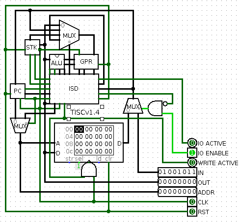

# Tiny Instruction Set Computer

This is a for-fun implementation of a relatively simple micro-architecture, with
an assembler to program the simulated implementation in [Logisim](http://www.cburch.com/logisim/).

## Want to play with it too?

The default program loaded in the ExampleConfigurationROM circuit is the
`ExamplePrograms/typing_test.tac` program. The program is an interactive demo
which processes text input from the keyboard component and echoes the text out
to the TTY component. In addition, the program buffers 32 characters and echoes
the buffer once the user inputs a line feed (enter key).

## Compiling the assembler

To compile the assembler, I recommend using GCC:

	gcc tisc.c -o tisc

## Using the assembler

Once the assembler is compiled, you can assemble TISC assembly code like so:

	tisc <input file> <output file>

If the assembler found no errors in the code, the output file will contain the
program that is ready to load into the Logisim circuit.

## Loading a program

The provided example application in the circuit ExampleConfigurationROM is a 
configuration with memory-mapped I/O. The I/O at memory address 0xFF is a ROM 
that acts as the program memory. Left-clicking on the component and selecting
'Load Image' will allow you to load memory images generated by the assembler. 
